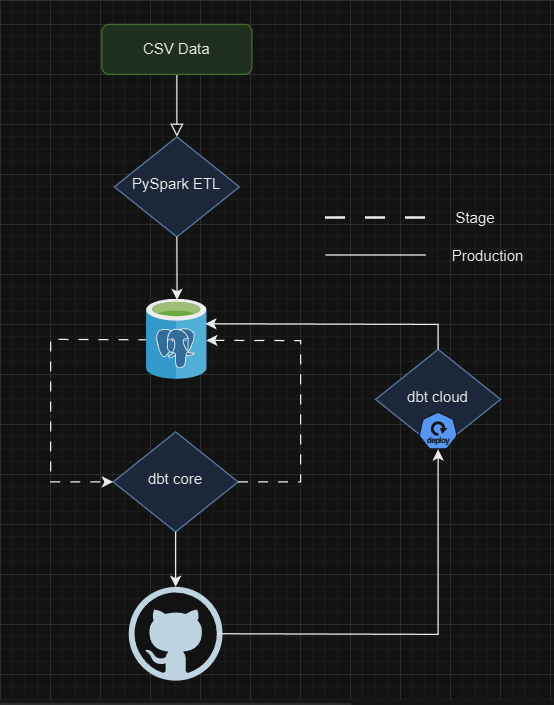

### **Project Title: Comprehensive Data Transformation and Analysis of German Credit Data Using dbt**

#### **Project Objectives:**
- To enhance my expertise in dbt by implementing a variety of advanced data transformation techniques on the German Credit Data.
- To design and build a robust data transformation pipeline that efficiently processes raw data into insightful, actionable reporting tables.
- To utilize dbt’s powerful features such as models, snapshots, tests, and macros to ensure data quality, traceability, and maintainability.
- To document every step of the transformation process for future reference and ensure that the final models are optimized for performance and scalability.

---
#### High Level Overview

    

---

---

---

---
#### **Project Outline:**

**1. Initial Setup**
   - **Project Initialization:** I have initialized a dbt project named `german_credit_analysis` and established a connection to my PostgreSQL database.
   - **Schema Organization:** I've organized the project by creating necessary folders for staging, intermediate models, aggregates, snapshots, and marts within the `models` directory.

**2. Staging Model**
   - **Creating the Staging Model:**
     - I developed the `stg_german_credit_data` model in the `staging` folder. This model is responsible for cleaning and standardizing the raw credit data, ensuring that all categorical values are properly mapped, null values are handled, and data types are appropriately cast.

**3. Intermediate Transformations**
   - **Credit Scoring Model:**
     - I created the `int_credit_scores` model to calculate a custom credit score based on the features provided in the dataset. This model applies specific scoring logic to assess the creditworthiness of each customer.
   - **Customer Segmentation:**
     - I developed the `int_customer_segmentation` model to segment customers based on their credit score, age, and other demographic factors. This segmentation is crucial for identifying different risk profiles among customers.
   - **Default Risk Prediction:**
     - I implemented the `int_default_risk` model, which predicts the likelihood of a customer defaulting on their credit. This model integrates the risk segmentation with other variables to provide a comprehensive risk assessment.

**4. Advanced Transformations**
   - **Historical Snapshot:**
     - I set up a `snap_credit_scores` model to track changes in customer credit scores over time. Using dbt’s snapshot feature, I can monitor trends and shifts in creditworthiness across different periods.
   - **Aggregations and Summarization:**
     - I created the `agg_credit_summary` and `agg_segmented_default_rates` models to summarize the credit data. These models calculate averages, sums, and default rates by customer segment and age group, providing valuable insights for further analysis.

**5. Data Quality Testing**
   - **Implementing Column Testing:**
     - I have incorporated dbt tests in the `schema.yml` file to ensure data quality across the models. Tests include checks for uniqueness, non-null values, and accepted values for categorical columns.
   - **Creating Custom Tests:**
     - I also developed custom tests to detect logical inconsistencies, such as customers with zero income but high credit amounts, ensuring the integrity of the data.

**6. Documentation and Deployment**
   - **Documenting the Project:**
     - I have thoroughly documented all models using dbt’s documentation features. Each model, column, and test is described in detail within the `schema.yml` file. I can generate and view the documentation using `dbt docs generate` and `dbt docs serve`.
   - **Deploying the Models:**
     - I ran the dbt models using `dbt run` to deploy them to the database. The final reporting tables are now ready for analysis and visualization.

**7. Enhancing with Macros**
   - **Creating Reusable Macros:**
     - I have written reusable macros that simplify repetitive tasks within the project. These macros are applied across multiple models to ensure consistency and efficiency in the transformations.

**8. Final Review and Optimization**
   - **Optimizing Model Performance:**
     - I reviewed and optimized the SQL queries in each model to ensure they run efficiently. I utilized materializations like `incremental` and `table` to improve performance where necessary.
   - **Integrating CI/CD:**
     - If applicable, I would integrate this project with a CI/CD pipeline to automate testing and deployment, ensuring that future changes are seamless and well-managed.

---

#### **Deliverables:**
- **Complete dbt Project:** A well-structured dbt project with all necessary models, snapshots, tests, macros, and documentation.
- **Transformed Data Tables:** Finalized tables in the PostgreSQL database that are ready for analysis and reporting.
- **Comprehensive Documentation:** Detailed dbt documentation covering all transformations and processes involved in the project.

This project has not only deepened my understanding of dbt but also provided a comprehensive approach to transforming and analyzing credit data in a scalable, maintainable way.